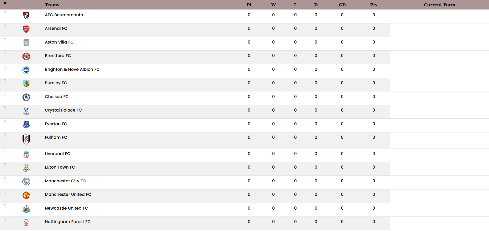

# EPL-data-board


**English Premier League** data is extracted through [Football-Data](https://www.football-data.org/) and created informative page for football enthusiast and fans to provide them reliable data and information about the *ONGOING* EPL.

`**NOTE** currenty there is no EPL happening ryt now, so data are not complete!! :(`


---

```
1. install django and python3 in your system 
```

```
2. git clone https://github.com/Kshitiz-Mhto/EPL-data-board.git
```

```
3. goto EPL-data-board directory
```

> copy the code below and paste in the terminal.

```
python3 manage.py runserver
```

> basically, the webpage will be at localhost:8000/ and for ` custom port `

```
python3 manage.py runserver <custom-port>
```

## Screenshots

<p align="center">
Landing Screen
</p>

<p align="center">
	
</p>

<p align="center">
Today Session
</p>

<p align="center">
	
</p>

<p align="center">
Current Season Standings
</p>

<p align="center">
	
</p>

<p align="center">
LOL
</p>

<p align="center">
	
</p>

<p align="center">
EPL teams
</p>

<p align="center">
	
</p>

<p align="center">
Topper in EPL
</p>

<p align="center">
	
</p>

`Form column will be added as soon as EPL will start in 2023. Thank you!!`